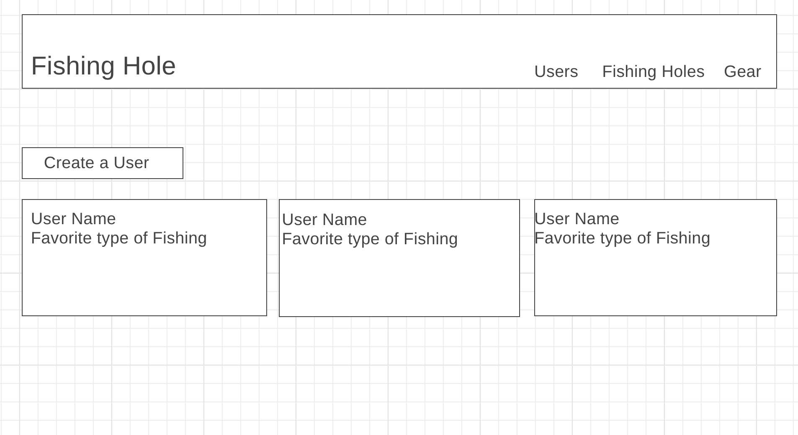

# Welcome to Fishing Hole

## Overview 
Fishing Hole is an app for users to be able to add their favorite fishing spots, and also add their preferred fishing gear.

## Link to Heroku and Trello

* <a href='https://fishing-hole.herokuapp.com/'>Heroku</a>

* <a href='https://trello.com/b/68iYlvgo/fishing-hole'>Trello</a>

## ERD and Wireframes

### Technologies

Javascript | Html | CSS | Materialize | Handlebars | MongoDB

### Second Iteration
* Ability to login with username and password
* Ability to store user favorites
* Update on gear kits for users
* Comment section for users